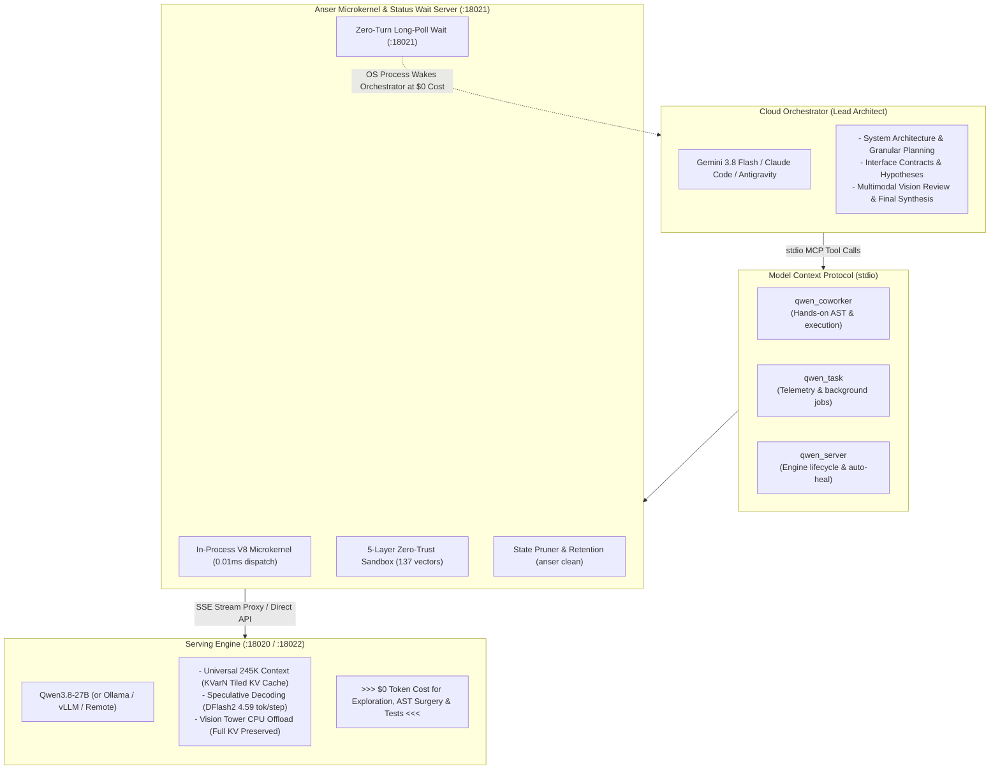
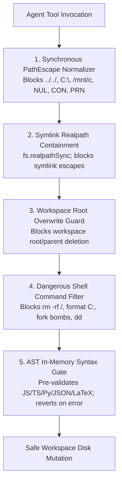

# Anser

**The Universal 245K Agent Microkernel & MCP Pair-Programming Harness.**

[-success?logo=githubactions&logoColor=white)](#testing--verification)
[](https://nodejs.org/)
[](LICENSE)
[](#testing--verification)
[](#model-serving--speculative-decoding)
[](#model-serving--speculative-decoding)
[](#zero-trust-sandboxed-file-operations)

> **Anser** is a model-agnostic serving harness and in-process agent microkernel exposed as a standard Model Context Protocol (MCP) server. It enables a high-reasoning cloud orchestrator (the *Lead Architect* — Google Antigravity, Gemini 3.8 Flash, or Claude Code) to drive a local or self-hosted execution model (such as **Qwen3.8-27B**, Ollama, or vLLM) as an autonomous peer programmer across any repository.
> 
> **The Ultimate API Bill Cutter:** The cloud orchestrator handles high-level architecture, task decomposition, and supervisory steering. The local coworker ingests repository context, executes structural AST refactoring, runs test loops, and mutates code at **$0 token cost**. **Zero cloud token hoarding. 90%+ API cost reduction.**

---

## Table of Contents

1. [The Paradigm: Cloud Brain + Local Hands](#the-paradigm-cloud-brain--local-hands)
2. [Benchmark & Economic Grounding](#benchmark--economic-grounding)
3. [System Architecture](#system-architecture)
4. [Core Capabilities](#core-capabilities)
5. [CLI Management & Quickstart](#cli-management--quickstart)
6. [Model Serving, Speculative Decoding & Multimodal Vision](#model-serving-speculative-decoding--multimodal-vision)
7. [Zero-Trust Sandboxed File Operations](#zero-trust-sandboxed-file-operations)
8. [Testing & Verification](#testing--verification)
9. [Repository Structure](#repository-structure)
10. [License & Commercial Dual-Licensing](#license--commercial-dual-licensing)

---

## The Paradigm: Cloud Brain + Local Hands

### The Problem: Cloud Token Hoarding & Runaway API Bills
Traditional agentic workflows suffer from **cloud token hoarding**:
1. **Compounding API Costs**: Pointing frontier cloud models (Claude Opus, GPT-5, Claude Sonnet) at large repositories repeatedly packs hundreds of thousands of context tokens into prompt prefill on every turn. Ingesting whole codebases, search hits, and compiler logs burns millions of tokens and easily generates $50–$250 in API bills in a single afternoon.
2. **Context Window Saturation**: Cloud context windows get congested with ephemeral compiler outputs, raw file dumps, and intermediate test traces, degrading reasoning quality and inflating latency.
3. **The Polling Tax**: When an autonomous agent launches a long-running build or test suite, traditional orchestrators poll in an active LLM loop, squandering reasoning compute just waiting for a subprocess to exit.

### The Solution: Asymmetric Pair-Programming Delegation over MCP
Anser establishes an asymmetric division of labor:
- **Lead Architect (Cloud Context)**: Frontier orchestrators (Gemini 3.8 Flash in Antigravity or Claude Code) focus strictly on high-level architecture, formal interface specification, multimodal vision review, and supervisory steering. The orchestrator never hoards raw repository trees into cloud context.
- **Autonomous Execution Coworker (Local Anser @ $0)**: Local Qwen3.8-27B (or any OpenAI-compatible engine) runs inside the in-process Anser microkernel, executing structural AST queries, file editing, test execution, and codebase exploration at **$0 token cost**.
- **Zero-Turn Reactive Wait**: Extended tasks yield a durable OS-level wait hook (`curl.exe -fsS http://127.0.0.1:18021/task/<id>/wait`). The cloud orchestrator blocks at **$0 token cost** and is reactively awakened by the OS kernel the instant the coworker concludes.



---

## Benchmark & Economic Grounding

### The Agentic Sweet Spot: Dense 27B on Consumer Silicon
In continuous agentic pair-programming—where 80%+ of prompt tokens are spent iteratively ingesting repository context, checking compiler logs, running AST searches, and applying patches—routing every single turn to paid cloud APIs is economically unsustainable.

**Qwen3.8-27B** via Anser delivers the optimal sweet spot:
- **Consumer Hardware Footprint**: Dense 27B parameter model fitting completely within a single consumer **24 GB VRAM GPU** (NVIDIA RTX 3090 / 4090) using W4A16 AutoRound quantization.
- **Universal 245K Context**: Ingests entire repositories, test traces, and multi-turn message history with KVarN tiled KV caching.
- **Asymmetric Economics**: The Lead Architect handles top-level system architecture and code review, while Qwen3.8-27B executes hands-on AST surgery and test verification locally at **$0 token cost**.

### Cost Comparison Matrix

| Evaluation Dimension | Qwen3.8-27B (via Anser) | Claude Sonnet 5 | Claude Opus 5.5 | GPT-6 Astra | GLM-5.3 |
|---|---|---|---|---|---|
| **Inference Location** | **100% Local (RTX 3090/4090 24GB)** | Managed Cloud API | Managed Cloud API | Managed Cloud API | Managed Cloud API |
| **AA Coding Profile / Role** | Dense local execution & AST surgery | High-efficiency cloud standard | Deep reasoning & formal verification | Frontier coding leader | Cloud tool-calling champion |
| **API Cost: Prompt Prefill** | **$0.00 / million tokens** | $2.00 / million tokens | $4.00 / million tokens | $10.00 / million tokens | $1.40 / million tokens |
| **API Cost: Completion Output** | **$0.00 / million tokens** | $10.00 / million tokens | $20.00 / million tokens | $50.00 / million tokens | $4.40 / million tokens |
| **Context Window Ceiling** | **245,760 tokens** (Universal 245K) | 500,000 tokens | 1,000,000 tokens | 1,000,000 tokens | 200,000 tokens |
| **Tool Execution Latency** | In-process microkernel (0.01 ms) | Remote network API / MCP | Remote network API / MCP | Remote network API / MCP | Remote network API / MCP |
| **Cloud Token Hoarding** | **None** (Only synthesized slices sent to cloud) | Heavy (Full repos hoarded into prompt) | Heavy (Full repos hoarded into prompt) | Heavy (Full repos hoarded into prompt) | Heavy (Full repos hoarded into prompt) |

---

## System Architecture

Anser exposes three consolidated, stdio-pure MCP tools to any client:

1. **`qwen_coworker`**: Primary hands-on coworker interface.
   - Accepts `prompt`, `cwd`, `session_id`, `reasoning_effort` (`xhigh` | `medium` | `low`), and optional MCP `extensions`.
   - Executes with Universal 245K context and test-time deliberation.
2. **`qwen_task`**: Background task management & telemetry.
   - Actions: `status`, `cancel`, `cancel_all`, `list`, `stats`, `extend_lease`.
   - `stats` returns real-time cumulative token usage, generation throughput, cache telemetry, and financial savings.
3. **`qwen_server`**: vLLM engine lifecycle supervisor.
   - Actions: `status`, `start`, `stop`.
   - Automatically handles cold boots, health canary checks, wedge detection, and self-healing.

---

## Core Capabilities

### 1. In-Process Runtime & Invisible Syntax Gates
- **In-Process Microkernel**: Core file tools (`read_file`, `write_file`, `edit_file`, `apply_patch`, `ast_search`) run directly inside the Node.js process without subprocess spawning overhead.
- **In-Memory Syntax Validation**: Modifications made via `edit_file` are parsed in-memory (TypeScript, JavaScript, Python, JSON, LaTeX, BibTeX) before touching disk. Syntax regressions and malformed patches are rejected immediately with line-level diagnostics, preventing corrupted codebases.

### 2. Dual Multimodal Vision Authority
- **Universal Vision Capabilities**: Both the Lead Architect (Gemini 3.8 Flash in Antigravity) and local Qwen3.8-27B support multimodal image inputs.
- **Visual Asset Inspection**: Inspect rendered UI components, layout screenshots, diagrams, and visual design assets locally at $0 token cost.
- **Vision-Tower CPU Offload**: The vision tower runs efficiently with pinned host RAM offloading, retaining the complete 245K KV cache in GPU VRAM.

### 3. Multi-Provider Web & Framework Documentation Engine
Anser embeds native, dependency-free `web_search` and `web_fetch` services:
- **Intelligent Provider Routing**: Automatically routes queries across **Brave Search**, **Tavily**, **Context7** (targeted library documentation), **SearXNG**, and **DuckDuckGo** with rate limiting and configuration support.
- **Markdown Normalization**: Automatically extracts clean, readable markdown content from web pages and documentation.

### 4. Automated State Directory Pruning & Retention (`anser clean`)
- **Retention Invariants**: Manages session history and task logs under `~/.anser/` with a 14-day max age, 200-session count ceiling, and 50 MB size cap.
- **Active Task Immunity**: Active sessions and sessions referenced by running tasks are protected from eviction.
- **CLI & Auto-Prune**: Execute `anser clean [--dry-run]` anytime, or let the MCP server clean opportunistically on boot with a 24-hour throttle.

### 5. Cooperative Landing & Turn Ceiling Preservation
- **Zero-Progress-Loss Landing**: When a long-running dispatch reaches its turn budget ceiling (turn 80), tool calling is gracefully concluded and the model performs mandatory deliverable synthesis.
- **Honest Status Taxonomy**: Completed deliverables are preserved under `completed_budget_exhausted` with structured `[!WARNING]` advisory banners.

### 6. Zero-Turn Reactive Wait (`/task/<id>/wait`)
Long-running background tasks yield a durable OS wait command. The orchestrator executes:
```bash
curl.exe -fsS --retry 5 --retry-delay 2 http://127.0.0.1:18021/task/<id>/wait
```
The OS process blocks at **$0 token cost** and wakes the orchestrator the moment the coworker finishes.

---

## CLI Management & Quickstart

Anser provides a dedicated CLI tool (`anser`) for 1-command registration, configuration, and maintenance.

### 1. Install & Build
```bash
git clone https://github.com/ApatheticMioz/Anser.git
cd Anser/mcp-qwen
npm ci
```

### 2. Verify the Offline Test Gate
```bash
# Instant canary gate (~4s, 9 critical suites)
npm test

# Full authoritative gate (66 suites; offline & deterministic)
npm run test:all
```

### 3. Configuration & Registration
```bash
# Register with Claude Code
claude mcp add --scope user qwen-anser node <repo-path>/mcp-qwen/index.js

# Register with Google Antigravity IDE
python <repo-path>/mcp-qwen/update_schemas.py

# Inspect or configure Anser settings
node bin/anser.js config list
node bin/anser.js config set model "qwen3.8-27b"
node bin/anser.js config set baseURL "http://localhost:18020/v1"

# Prune stale session files and reclaim disk space
node bin/anser.js clean --dry-run
node bin/anser.js clean
```

---

## Model Serving, Speculative Decoding & Multimodal Vision

The serving stack is optimized for consumer 24 GB GPUs (NVIDIA RTX 3090 / 4090):
- **Model**: Qwen3.8-27B (hybrid dense Gated-DeltaNet + attention, 65 layers, W4A16 AutoRound).
- **Multimodal Vision**: Enabled with `VISION=1` and `VLLM_VISION_CPU_OFFLOAD_GB=1`, keeping the vision tower in host RAM while preserving all 268,000+ KV cache tokens.
- **Speculative Block Drafter**: DFlash2 1.92B non-autoregressive drafter yielding 4.59 tokens/step mean acceptance.
- **KVarN Tiled KV Cache**: 4-bit keys / 2-bit values per 128-token tile, providing a 245,760-token ceiling within 24GB VRAM.

---

## Zero-Trust Sandboxed File Operations

Anser implements a **5-layer defense-in-depth boundary** ensuring neither the coworker nor external agents can escape the workspace root:



Verified by a **137-vector containment suite** (`tests/security.test.js`: 123 attack vectors blocked, 14 allow vectors permitted).

---

## Testing & Verification

Every pull request is validated across **Node 22 & 24 on Ubuntu and Windows**:

```bash
npm test --prefix mcp-qwen              # 9 critical canary suites (~4s)
npm run test:all --prefix mcp-qwen      # 66 suites total (full CI gate)
npm run test:telemetry --prefix mcp-qwen # Telemetry & pricing arithmetic verification
```

All source files deterministically enforce the Universal LF invariant (`* text=auto eol=lf`).

---

## Repository Structure

```
Anser/
  README.md                 # Production architecture, benchmarks, and quickstart
  CHANGELOG.md              # Project release history & generational changelog
  AGENTS.md                 # Machine-readable operating contract
  CONTRIBUTING.md           # Contributor workflow and PR guidelines
  SECURITY.md               # Private vulnerability reporting policy
  LICENSE                   # GNU AGPLv3
  scripts/wsl/              # Serving launch & lifecycle scripts (vLLM, KVarN, DFlash2)
  mcp-qwen/                 # Core Anser microkernel & MCP server
    index.js                # MCP server entry point (3 consolidated tools)
    stream_proxy.js         # :18022 universal SSE streaming proxy
    bin/anser.js            # CLI management tool (init, config, clean, mcp)
    src/
      config.js             # Configuration, state directories & port defaults
      state_pruner.js       # Session retention & task log pruner
      server_lifecycle.js   # Serving engine boot, canary, & health checks
      wsl_bridge.js         # Cross-platform execution & process tree management
      telemetry.js          # Cross-platform token & financial savings tracker
      harness/              # In-process Anser microkernel
        runner.js           # Multi-turn execution loop & watchdog guards
        core/               # Kernel plugin registry & event system
        services/           # Sandboxed FS, AST, Shell, Web research services
        evo/                # Evolutionary optimizer, lineage DAG & rollback
    tests/                  # 66 automated test suites
```

---

## License & Commercial Dual-Licensing

Licensed under the **[GNU Affero General Public License v3 (AGPL-3.0)](LICENSE)** — **Anser Contributors**.

- **Open Source & Copyleft**: Anser is free and open-source software. You are free to inspect, run, modify, and redistribute it under the terms of the AGPLv3.
- **Enterprise & Dual-Licensing**: If you wish to embed Anser's microkernel or sandbox components into a proprietary commercial product or internal closed infrastructure without copyleft obligations, a commercial dual-license is available. Inquiries: [`ApatheticMioz@gmail.com`](mailto:ApatheticMioz@gmail.com).

### Acknowledgments
- **Qwen Team (Alibaba Cloud)** for Qwen3.8-27B.
- **vLLM Project** for high-throughput LLM serving.
- **Huawei CSL** for [KVarN](https://github.com/huawei-csl/KVarN).
- **Inco AI** for the [DFlash2](https://inco.ai/blog/dflash2/) block drafter.
- **Herrington Darkholme** for [ast-grep](https://github.com/ast-grep/ast-grep).
- **syv-ai** for [HyperQwen](https://github.com/syv-ai/HyperQwen) serving baselines.
