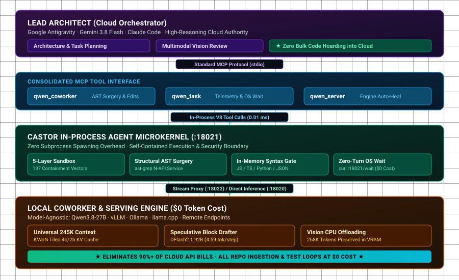
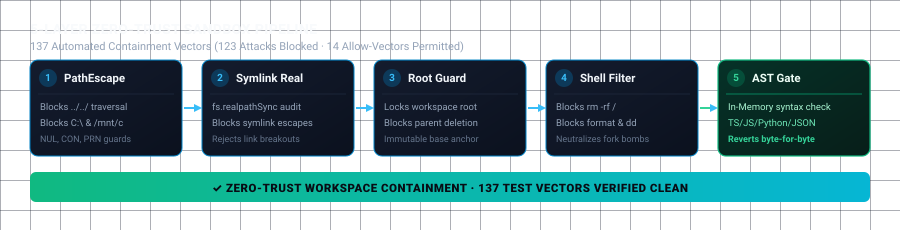

# Castor

**The Universal 245K Agent Microkernel & MCP Pair-Programming Harness.**

[](#testing--verification)
[](https://www.rust-lang.org/)
[](LICENSE)
[](#testing--verification)
[](#model-serving--speculative-decoding)
[](#model-serving--speculative-decoding)
[](#zero-trust-sandboxed-file-operations)

> **Castor** is a model-agnostic serving harness and in-process agent microkernel written in Rust and exposed as a standard Model Context Protocol (MCP) server. It pairs high-reasoning cloud orchestrators (Google Antigravity, Gemini 3.8 Flash, Claude Code) with locally-served execution models (**Qwen3.8-27B**, Ollama, vLLM, llama.cpp) across any repository.
> 
> **The Ultimate API Bill Cutter:** The cloud orchestrator handles high-level architecture, task decomposition, and supervisory steering. The local coworker ingests repository context, executes structural AST refactoring, runs test loops, and mutates code at **$0 token cost**. **Zero cloud token hoarding. 90%+ API cost reduction.**

---

## System Architecture

<p align="center">
  
</p>

### The Asymmetric Division of Labor
- **Cloud Orchestrator (Lead Architect)**: Focuses strictly on architecture, formal interface specification, multimodal vision review, and supervisory steering. Never hoards raw codebase files into paid prompt context.
- **Local Coworker (Hands-on Execution @ $0)**: Ingests repositories, analyzes traces, performs AST surgery (native `ast-grep`), and verifies code locally inside the in-process Castor microkernel.
- **Zero-Turn Reactive Wait**: Long-running background dispatches yield an OS-level wait hook (`curl :18021/task/<id>/wait`). The cloud orchestrator blocks at **$0 token cost** and wakes reactively the moment the coworker completes.

---

## Consolidated MCP Interface

Castor exposes three stdio-pure MCP tools to any client:

1. **`castor_coworker`**: Primary execution interface.
   - Accepts `prompt`, `cwd`, `session_id`, `reasoning_effort` (`xhigh` | `medium` | `low`), and optional MCP `extensions`.
   - Executes with Universal 245K context and test-time deliberation.
2. **`castor_task`**: Background task management & telemetry.
   - Actions: `status`, `cancel`, `cancel_all`, `list`, `stats`, `extend_lease`.
   - Returns real-time cumulative token counts, generation throughput, cache hit rates, and financial savings.
3. **`castor_server`**: Inference engine lifecycle supervisor.
   - Actions: `status`, `start`, `stop`.
   - Manages engine boot, health canaries, wedge detection, and auto-healing.

---

## Core Capabilities

- **In-Process Microkernel & AST Surgery**: File operations and structural AST replacements (native `ast-grep`) execute in-process (<0.1 ms dispatch) without subprocess overhead.
- **In-Memory Syntax Gates**: Pre-validates modifications in-memory (TypeScript, JavaScript, Python, JSON) before committing to disk, preventing corrupted files.
- **Dual Multimodal Vision Authority**: Cloud orchestrators (Gemini 3.8 Flash) and local Qwen both support image inputs. Vision-tower CPU offload retains the complete 268K+ KV cache in GPU VRAM.
- **Multi-Provider Web Research**: Native `web_search` and `web_fetch` routing across SearXNG, Brave Search, and DuckDuckGo with HTML-to-markdown extraction.
- **Automated State Pruning (`castor clean`)**: Automatic retention policy over `~/.castor/` (14-day max age, 200-session count, 50MB ceiling, `.tmp_*` cleanup) with active session immunity and 24-hour startup throttling.
- **Cooperative Landing**: Dispatches reaching their turn budget conclude gracefully with mandatory deliverable synthesis under `completed_budget_exhausted` instead of arbitrary process kills.

---

## Zero-Trust Sandboxed File Operations

Castor implements a **5-layer defense-in-depth boundary** ensuring neither the coworker nor external agents can escape the workspace root:

<p align="center">
  
</p>

1. **PathEscape Normalizer**: Rejects directory traversal (`../../`), raw drive letters (`C:\`), and device namespaces (`NUL`, `CON`, `PRN`).
2. **Symlink Realpath Containment**: Resolves real canonical paths to block symlink breakouts.
3. **Workspace Root Overwrite Guard**: Protects the workspace root and parent directories from deletion or replacement.
4. **Dangerous Shell Filter**: Neutralizes destructive commands (`rm -rf /`, `format`, fork bombs, `dd`).
5. **AST In-Memory Syntax Gate**: Validates syntactical integrity before disk commit; rolls back on parse errors.

*Verified by a 137-vector automated containment suite (`src/tools/sandbox.rs`: 123 attack vectors blocked, 14 allow vectors permitted).*

---

## Quickstart

### Building from Source

```bash
git clone https://github.com/ApatheticMioz/Castor.git
cd Castor

# Build the Rust binary
cargo build

# Run unit and integration tests (242 tests, ~7s)
cargo test

# Register with Claude Code and Antigravity IDE
./target/debug/castor install --client all
```

### Running the MCP Server

```bash
# Directly
./target/debug/castor mcp

# Or via cross-platform Node shim
node bin/castor.js mcp
```

---

## Repository Structure

```
Castor/
  Cargo.toml                # Root crate manifest
  Cargo.lock                # Deterministic dependency lockfile
  package.json              # Distribution manifest for npm shim
  bin/castor.js             # Cross-platform distribution shim
  skills/                   # Reusable SKILL.md workflow recipes
  src/
    main.rs                 # CLI entry point (clap dispatch, worker runner)
    config.rs               # Unified serde configuration loader
    platform.rs             # Cross-OS path translation and process management
    skills.rs               # agentskills.io SKILL.md indexer
    telemetry.rs            # JSONL event ledger & derived statistics
    pruner.rs               # State dir retention pruner
    mcp/                    # rmcp stdio transport, schemas, and worker
    task/                   # Task registry, long-poll HTTP wait, semaphore
    proxy/                  # Stream proxy, SSE sanitizer, repetition breaker
    engine/                 # vLLM / OpenAI client, lifecycle, health canary
    runner/                 # Autonomous agent loop, loop detection, events
    tools/                  # Sandboxed FS, AST search/replace, shell, web
    evo/                    # Offline evolutionary optimizer & lineage DAG
  evals/                    # Tier A offline replay and golden test tasks
```

---

## License & Commercial Dual-Licensing

Licensed under the **[GNU Affero General Public License v3 (AGPL-3.0)](LICENSE)** — **Castor Contributors**.

- **Open Source & Copyleft**: Free and open-source software under AGPLv3. Network use requires complete source distribution of modified versions.
- **Commercial Dual-Licensing**: Available for proprietary embedding without copyleft obligations. Inquiries: [`ApatheticMioz@gmail.com`](mailto:ApatheticMioz@gmail.com).

### Acknowledgments
- **Qwen Team (Alibaba Cloud)** for Qwen3.8-27B.
- **vLLM Project** for high-throughput LLM serving.
- **Huawei CSL** for [KVarN](https://github.com/huawei-csl/KVarN).
- **Inco AI** for the [DFlash2](https://inco.ai/blog/dflash2/) block drafter.
- **Herrington Darkholme** for [ast-grep](https://github.com/ast-grep/ast-grep).
- **syv-ai** for [HyperQwen](https://github.com/syv-ai/HyperQwen) serving baselines.
